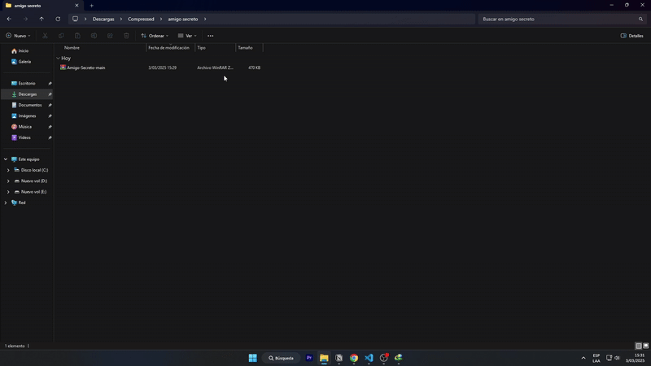
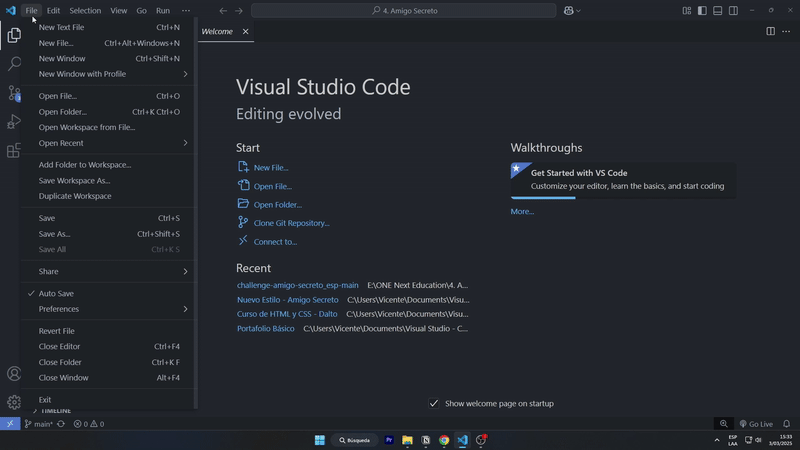
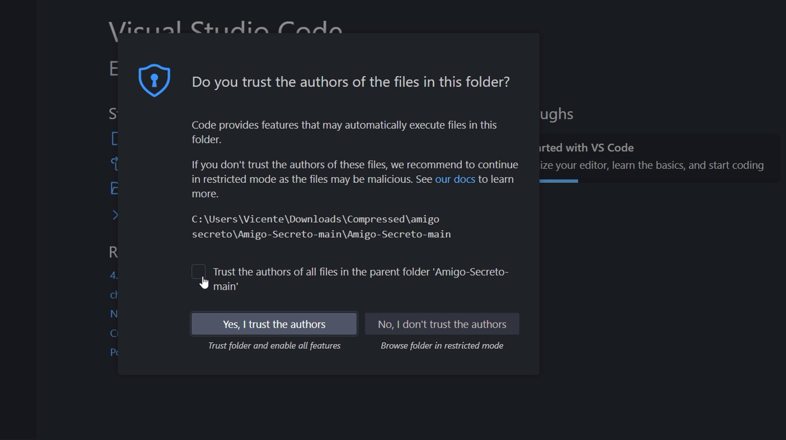
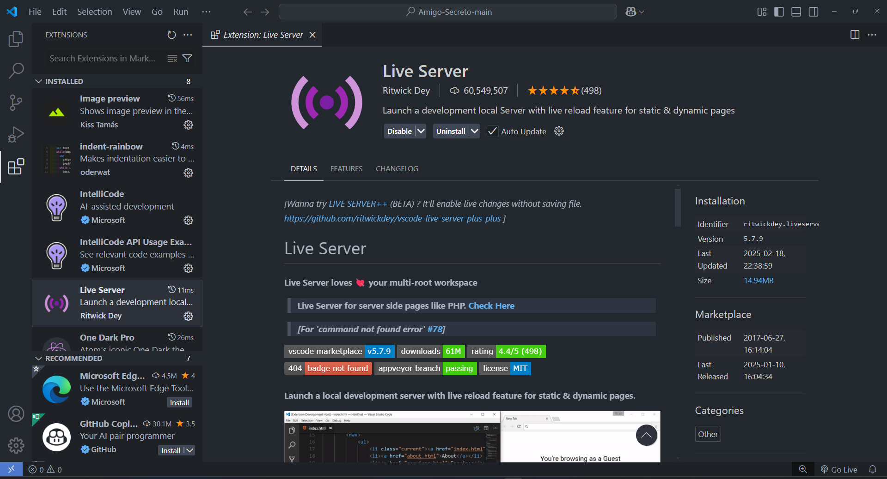
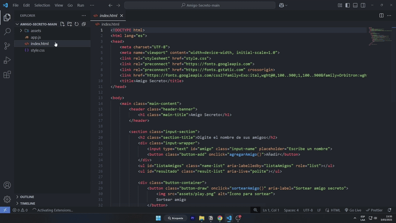

<h1 align="center"> Proyecto - Amigo Secreto </h1>


<p align="left">


</p>

## Descripción del Proyecto
El proyecto es una aplicación que te permite agregar los nombres de tus amigos(usuarios) y con un clic seleccionará aleatoriamente a uno de ellos, mostrándolo como el Amigo Secreto(ganador).

## Características y Demostración

### Propiedades Adicionales Usados en el proyecto
#### Agregar los Amigos secretos a li
- Se debe agregar cada nombre al nuevo **li** que se creará, este proceso se realizo usando **element.textContent = "Texto”**.
    
    **Ejemplo:**
    
    ```jsx
    nuevoParrafo.textContent = "Hola, esto es un texto";
    ```
    
    - Se guarda el contenido de tipo texto en la variable nuevoParrafo(hace referencia a una tag p).
    
    **En el proyecto:**
    
    ```jsx
    li.textContent = listaAmigos[i];
    ```
    
    - Se agregara el texto guardado en una determinada posición de ***listaAmigos*** en el nuevo elemento li.

#### Crear elementos y guardarlos en el DOM
- Para crear un elemento, que se guadará en memoria y aún no se registrara,en el DOM, en html usamos **document.createElement("*tag*")**
    
    ```jsx
    let li = document.createElement("li");
    ```
    
    - En el proyecto fue utilizado para crear elementos li que posteriormente se agregaran dentro del elemento ul, con el propósito de que se muestren los nombres agredos en formato de lista.
    
    

- Para que el elemento se cree y se registre en el DOM, usamos **parent.appendChild(*element*)**.
    - Este nos permite crear elementos dentro de otro.
    
    Ejemplo:
    
    ```jsx
    document.body.appendChild(p);
    ```
    
    - Se crea un párrafo nuevo en el body del DOM del sitio web.
    
    **En el proyecto:**
    
    ```jsx
    ul.appendChild(li); 
    ```
    
    - El nuevo elemento **li** se guardará, registrandose en el **DOM**, en el elemento **ul**.

**Nota**

| **Estado** | **Descripción** |
| --- | --- |
| Solo en memoria | Cuando lo creas con ***createElement( )***, existe en JavaScript, pero no en HTML visible. |
| En el DOM (HTML visible) | Cuando lo agregas con ***appendChild( )***, ya forma parte del HTML y se muestra en la página. |

#### Verificar elementos en una Arreglo

- Para verificar si un arreglo está vacio, usamos un condicional con el operado: **arreglo.lenght === 0**
    
    ```jsx
        if(arreglo.length===0){
    				//Se ejecuta el proceso si no hay elementos en el arreglo
        }else {
    				//Se ejecuta el proceso, cuando hay elementos en el arreglo.
        }
    ```
    
    **En el proyecto**
    
    - Es necesario verificar si hay nombres guardados en el arreglo, para que posteriormente pueda mostrar el nombre del amigo sorteado.
        
        ```jsx
            if(listaAmigos.length===0){
                alert('No hay ningun nombre agregado, Agregue un nombre')
            }else {
                //proceso
            }
        ```
        
        - Verificamos que exista un nombre agregado, de lo contrario se mostrará una alerta en la pantalla.

#### Eliminar varios elementos li

- Para eliminar todos los elementos **li** que se encuentran dentro de un **ul**, usaremos:
    - Para que devuelva el primer elemento:  **.firstChild**.
    - Para eliminar un elemento que se encuentra en primer lugar:  **.removeChild**.
    
    ```jsx
        while (elementoUl.firstChild) { 
            elemento.removeChild(elemento.firstChild); 
        }
    ```
    
    - El buble While se ejecutara siempre y cuando exista un primer elemento dentro de ul.
    - En cada iteración se eliminará el primer elemento, por lo que el siguiente elemento que sigue será el primero y en la siguiente iteración también será eliminado.
    - Al final, ya no habrán primeros elementos en ul, por que todos fueron eliminados.

**En el Proyecto:**

- Para reiniciar nuevamente el juego, debemos eliminar el nombre del amigo secreto y todos los nombres que se han agregado.
- Si se agregaron varios nombres, entonces aplicaremos el proceso explicado anteriormente.
    
    ```jsx
        while(ul.firstChild){
            ul.removeChild(ul.firstChild);
        }
    ```
    
    - Eliminará, en cada iteración, los nombres que se encuentra en la primera posición del arreglo.

### Funcionalidades
- `Agregar Nombres`: Los usuarios podrán escribir el *nombre de sus amigos* en el campo de texto y los agregaran a una lista dando clic en **añadir**.

- `Validación de Nombres`: Si no se a escrito nada en el campo de texto y aún asi se da clic en **añadir**, entonces mostrará un mensaje para que *escriba un nombre correcto*.

- `Visualizar Lista`: Todos los usuarios que se *añadan*, se mostrarán como listado debajo del campo de texto.

- `Selección Aleatoria`: Al dar clic en el boton **Sortear amigo**, se elegirá un nombre aleatoriamente del listado agregado y se mostrará en la pantalla.

- `Reiniciar`: Al dar clic en **Reiniciar**, se borrará la lista de amigos agregados y también el amigo secreto.

- `Interactivo`: Solo se mostrará el *listado de amigos* cuando se agregue alguno al dar clic en **añadir**.


### Video Demostrativo
- Para abrir en otra pestaña **Ctrl + clic**.
<a href="https://www.youtube.com/watch?v=cjRRujHb0hs" target="_blank">
  
</a>


## Acceso
1. Accede al proyecto [Enlace 🔗](https://github.com/Programador98/Amigo-Secreto) y descargalo en formato *zip*.


2. Descomprime el archivo. Puedes usar programas como [Winrar](https://winrar.es/descargas) para hacerlo.


3. Accede al proyecto desde **Visual Studio Code**.


4. Debes permitir el proyecto.


5. Descarga la extension **Live Server** desde **Visual Studio Code**.


6. Ubicate en el archivo **.html** ,y para ejecutar el proyecto en el navegador *clic* en **Go Live**.


## Tecnologías utilizadas


<b>HTML</b>


<b>CSS</b> 


<b>JavaScript</b>


## Developers
<p>El proyecto exite gracias a ⤵️</p>

<p><a href="https://github.com/Programador98">
  
</a>
<p><b>Programador98</b></p>
<p>


## Sponsors
Proyecto realizado como desafio en la formación de **ONE - Oracle** y **Alura Latam**, con el objetivo de aplicar todo lo aprendido de los conceptos básico de JavaScript. Thanks

<a href="https://www.aluracursos.com/" target="_blank">

</a><a href="https://www.oracle.com/pe/education/" target="_blank">

</a>


### Thank you for being interested in my project
